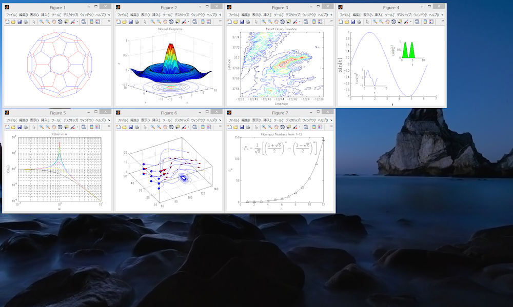

gridfigure
==========
Running Gridfigure lets figure windows automatically appear organized in grid style, without any commands.
Gridfigure also provides a command to batch resize and organize figures in grid style, with full support of multiscreens.

 

### Automatic Alignment
After installation, by executing the code below, automatic alignment becomes effective:

    set(0,'defaultfigurecreatefcn',@(varargin) gfigure('tail','nofocus',varargin{1}));

Writing this code in startup.m will improve convenience. (see http://www.mathworks.com/help/matlab/ref/startup.html for details on startup.m)

The above code alters the 'defaultfigurecreatefcn' property of 'figure'. Note that this feature is currently (1.16.2015) undocumented in MATLAB.

### Manual alignment:
Manual alignment is also possible:

    gfigure               ->  Align all visible figures in grid style
    gfigure 1:5           ->  Align specified figures in grid style
    gfigure 400 300       ->  Resize figure to 400x300 and align (setting is remembered)
    gfigure disp 2        ->  (-d) Show on second display (setting is remembered)
    gfigure row           ->  (-r) Align row-wise ('col' or '-s' for column-wise. setting is remembered)
    gfigure nofocus       ->  (-n) Don't give focus and only align
    gfigure tail          ->  (-t) Move figures to end
    gfigure size 400 300  ->  (-s) Explicitly specify figure size

Composite Calls are also possible:

    gfigure 400 300 row 1:5 disp 2
    gfigure 1 400 300 row           ->  Ambiguous call. gfigure guesses min(1,300) is the figure handle
    gfigure('disp',[3 1 2],400,300,[1 3 5 7 9])

### Installation
1. Save ./gridfigure in an arbitrary directory.
2. Open MATLAB and execute "pathtool"
3. Choose the "Add with Subfolders..." button,
   then choose the gridfigure directory you have added,
   then choose "OK", and then "Save".

### Changing Default Settings
Default figure size, subdisplay priority, oriantation could be changed by editing variables in gfigure.m ('edit gfigure.m').

----
### Authors
gridfigure
Copyright 2014, Hikaru Ikuta.
Distributed under the BSD License.

Multidisplay compatibility code is from myfigure:
Copyright 2014, Takashi Sugimoto.

Screenshot figures:

- Figure 1: http://www.mathworks.com/matlabcentral/fileexchange/35292-matlab-plot-gallery-graph-plot/content/html/Graph_Plot.html
- Figure 2: http://www.mathworks.com/matlabcentral/fileexchange/35311-matlab-plot-gallery-surface-contour-plot/content/html/Surface_Contour_Plot.html
- Figure 3: http://www.mathworks.com/matlabcentral/fileexchange/35282-matlab-plot-gallery-contour-plot/content/html/Contour_Plot.html
- Figure 4: http://www.mathworks.com/matlabcentral/fileexchange/35245-matlab-plot-gallery-plot-in-plot/content/html/Plot_in_Plot.html
- Figure 5: http://www.mathworks.com/matlabcentral/fileexchange/35265-matlab-plot-gallery-log-log-plot/content/html/Loglog_Plot.html
- Figure 6: http://www.mathworks.com/matlabcentral/fileexchange/35248-matlab-plot-gallery-streamline/content/html/Streamline.html
- Figure 7: http://www.mathworks.com/matlabcentral/fileexchange/35237-matlab-plot-gallery-adding-latex-to-plots/content/html/Add_Latex_to_Plot.html
- Desktop Image: Seascape after sunset
  11.24.2007, Rnbc, http://en.wikipedia.org/wiki/User:Rnbc
  http://commons.wikimedia.org/wiki/File:Seascape_after_sunset.jpg